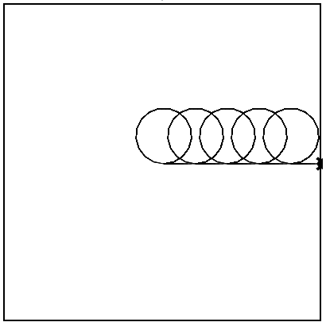

# Streched Slinky
### Write a program that will have Tracy draw a stretched out slinky.
The slinky should have:
* Five rings
* Each circle should have a radius of 35
* Tracy should move forward 40 pixels after **every** circle

🐢 _**Make sure you don't change the first two lines of code or the last line of code!!**_
```python
from __setup import *
begin()
# Your code goes below here
# |    |    |    |    |
# v    v    v    v    v


# ^    ^    ^    ^    ^
# |    |    |    |    |
# Your code goes above here
end()
```

## Ending World




## 🟢 To run your code, execute the following after the $ prompt:
```
python3 main.py
```
## 🛑 To stop your code, click anywhere in Tracy's world




## :heavy_check_mark: To check your code for accuracy, execute the following after the $ prompt:
```
check50 mr-poston/labs/2021/turtle/01_stretched
```
Then enter your GitHub username and password when prompted.
For security, you’ll see asterisks (`*`) instead of the actual characters in your password.



## :memo: To submit your code for grading, execute the following after the $ prompt:
```
submit50 mr-poston/labs/2021/turtle/01_stretched
```
Then enter your GitHub username and password when prompted.
For security, you’ll see asterisks (`*`) instead of the actual characters in your password.

You will then see the following:
```
Keeping in mind the course's policy on academic honesty, are you sure you want to submit these files (yes/no)?
```
To submit, answer with `yes` or `y`.
