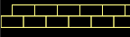
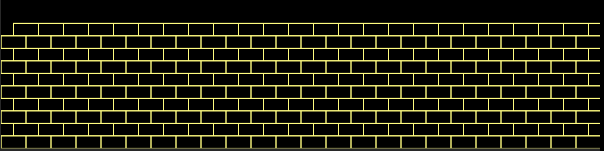

# Lab 2.2 - Yellow Brick Road

In this lab, you will use nested loops to draw a yellow brick road using as little scripting as possible.


#### How do I change the background color in Snap!?

1. Click on the Stage in the Sprite Corral.
2. Go to the Pen category.
3. Use the "set background color to" block.


### Part 1: Brick by Brick

1. Write a Snap! script to draw a single 20x10 "brick" in the lower left corner of the stage when the green flag is clicked.
2. Modify your script to draw two bricks side by side. The bricks should share a short edge, like this:  
3. Now modify your script again to build a full row of bricks across the entire length of the stage. Use a loop to keep your script as concise as possible. Remember that the stage is 480 pixels wide.

### **Part 2: Build a Road**

1. Build a row of bricks, add scripting to build a second row above the first row. The bricks in the second row should share a long edge with those in the first row, but should be "offset" so that the ends of the second row bricks are at the middle of the first row bricks, like this:  
2. Modify your script to build four total rows, alternating back and forth between the "regular" and "offset" rows. Use nested loops to keep your script concise.
3. Finish off the road the by building alternating rows all the way to the top of the stage. Your final road should look like this: 

### Grading Scheme/Rubric

| **Lab 2.2 Criteria** | Points |
| :--- | :--- |
| 1.2 2 bricks bottom left | 2 points |
| 1.3 row on bottom | 2 points |
| 2.1 second row offset | 2 points |
| 3.3 complete road | 2 points |
| No extra bricks | 1 point |
| Uses at least one nested loop | 2 points |
| Minimum redundancy in all | 1 point |
| **PROJECT TOTAL** | **12 points** |

