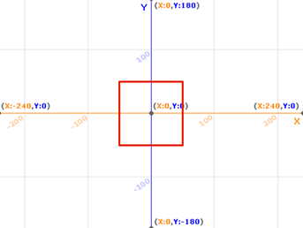

# Lab 3.4 (Advanced Option) - The Technicolor Window

In this lab, you will write custom **reporter** and **predicate** blocks to perform several useful calculations and computations. You will then use these blocks to make an art project (scroll to the bottom to see the result).

## 1 - Simple Computations

1.  Write a custom **reporter** block called **min** that determines which of two numbers is smaller and reports that value. If the two numbers are equal, report either one.

    Example: should report **2**
2.  Write a custom **reporter** block called **max** that determines which of two numbers is larger and reports that value. If the two numbers are equal, report either one.

    Example: should report **4**
3.  Write a custom **predicate** block called **between** that determines if a number is between two other numbers. If the first number is equal to either of the other two numbers or is between them, the block should report "true".

    Example: should report **true**, because 4 is between 3 and 10

## 2 - Stepping Things Up

1.  Write a custom SNAP reporter block called "distance to" that computes and reports the distance from a sprite's current position to another point passed in as two arguments. Use the (x position) and (y position) blocks to determine the sprite's position. Remember that the formula for the distance between points _(x1, y1)_ and _(x2, y2)_ is: $$\sqrt{(y_2 - y_1)^2 + (x_2 - x_1)^2}$$​

    Example: if your sprite is at (1,0), should report **5**.

    **Hint 1:** Snap does not have a "square" block. Instead, you can multiply a number by itself to square it. _Hey, maybe you should make the "square" operation a custom block!_

    **Hint 2:** The (sqrt of \_\_) block in the Operators tab can be used to calculate the square root.
2.  Write a custom Snap! reporter block called "snap to range" which takes a number and a range consisting of two other numbers (three arguments total). Ir the first argument is within the range, it simply reports the same number; otherwise it reports the number in the range which is closest to the first argument.

    Example: should report **5**, since 3 is closest to 5 in the range 5 to 10.

    Example: should report **7** since 7 is already in the range 5 to 10.

    **Hint:** Think about how you can use the blocks from Part 1 to write this block.

## 3 - Building on Our Work

1.  On the Snap! stage, imagine a square with corners at (-50, 50), (50, 50), (50, -50), and (-50, -50). In other words, the square covers the area of the stage from x = -50 to x = 50 and y = -50 to y = 50.

    I have drawn the square on the Snap! page below incase you have trouble picturing it. You _do not_ need to code this up. By now, I already know that you are an expert at drawing shapes!

    

    Create a custom Snap! block called "go randomly outside square" which will teleport a sprite to a random location OUTSIDE of the square's area. Looking at the image above, the sprite would go somewhere on the stage outside of the red lines. **Hint:** It may help to think of this in reverse - how can we tell if the sprite is _inside_ the square, using our custom blocks? How can we keep teleporting to random points on the stage until we know that the sprite _is not_ inside the square?

    Then, add an argument to the block to be used in place of "50" - in technical terms, this argument is half the length of a side of the square. **Hint:** For a given number "num", you can use (0 - num) or (-1 x num) to compute its negative. _Hey, maybe you should make a "negative of" custom block!_

    Example: will teleport the sprite to a random position on the stage which is not inside the square with corners at (-30, 30), (30, 30), (30, -30), and (-30, -30).
2.  Create a custom Snap! block called "go to square" that takes the same argument as before (i.e., half side length of a square centered at the stage origin); this block should make the sprite go to the nearest point on the square. If the sprite is already inside the square's area, then it does nothing. **Hint:** Writing this block is simple if we use the "snap to range" custom block.

    Example 1: If a sprite is at (100, 120) on the stage, then will cause it to move to (50, 50), the top right corner of the square.

    Example 2: If a sprite is at (35, -60) on the stage, then will cause it to move to (35, -50), a point on the bottom of the side of the square.

## 4 - Putting it All Together

1.  Finally, we are ready to make a program! Write a script so that when the green flag is clicked, all pen marks are cleared and a loop runs where the sprite repeatedly draws a line from a random location somewhere outside the square centered at the origin with a side length of 100 (i.e., "half side length" is 50) to a point on the perimeter of the square. Play around with the number of iterations of the loop (i.e., number of lines drawn) until you can see the outline of out imaginary square on the stage.

    
2.  Add code to the program so that if the sprite is at a distance of more than 150 steps away from the point (50, 50), it will point towards the center of the stage (use the \[point towards \_\_] block in the Motion category) and stamp itself (use the \[stamp] block in the Pen category) before it proceeds with the line drawing from the previous step. There should be no stamp marks within a radius of 150 steps from (50, 50). **Hint:** We already wrote a block to calculate distance to a point.

    
3. Add code so that the sprite hides itself once it is finished drawing (you will probably also want to make it show itself when the program begins so it is easier to re-run).
4. _**\*Optional Step\***_ Replace all the constraints in your script (square side length, number of lines drawn, stamp distance from the corner of the square) with custom reporters which simply report the same constants. What is the benefit of doing this? If you want to change any parameters of your artwork like the "window" size later, it is simpler since you only need to edit the custom blocks!
5.  Duplicate this sprite a few times (right-click the sprite in the sprite corral and select "duplicate" - the new sprite will have the same scripts) and give the copies different pen colors of your choosing. Re-run the program to observe your art with more color!

    
6. _**\*Optional Step\***_ Feel free to adjust the colors, line thicknesses, number of lines drawn per sprite, window size, and the "no stamp" radius before submitting your work.

## Grading Scheme / Rubric

| Criteria                              | Points         |
| ------------------------------------- | -------------- |
| 1.1 min block                         | 1 Point        |
| 1.2 max block                         | 1 Point        |
| 1.3 between block                     | 1 Point        |
| 2.1 distance to block                 | 1 Point        |
| 2.2 snap to range block               | 1 Point        |
| 3.1 go randomly outside square block  | 1 Point        |
| 3.2 go to square block                | 1 Point1 Point |
| 4.1 repeated random line drawing      |                |
| 4.2 stamping                          | 1 Point        |
| 4.3 sprite hide when finished drawing | 1 Point        |
| 4.5 duplicates with color             | 1 Point        |
| **Total**                             | **11 points**  |
