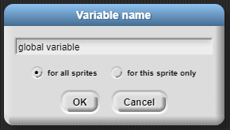
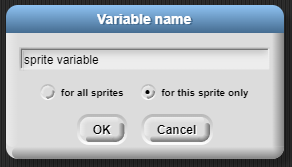

# Global Variables vs. Sprite Variables

### Global Variables

Global variables ("for all sprites") are visible to and usable by all sprites in the program.

Global variables are best for application-level data, such as sprite counts, game level number, score, etc.

### Sprite Variables

Sprite variables ("for this sprite only") are only visible to and usable by a single sprite.

Sprite variables are best for properties that may be specific to each sprite, such as speed, id #, etc.

When cloning is used, each clone gets its own copy of any sprite variables inherited from the prototype.
